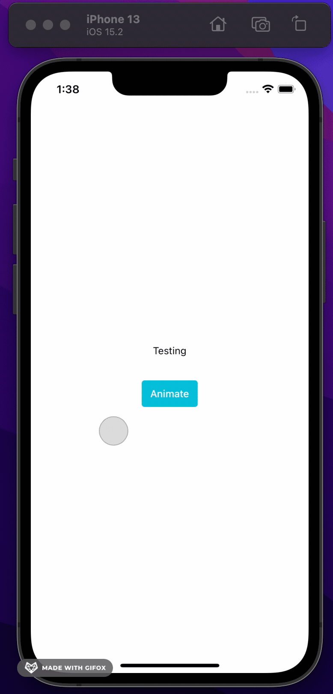

# react-native-animated-border
A simple view that animates the border using a fill animation

<!--  -->


## Installation

```sh
npm install react-native-animated-border
```

## Usage

```js
import AnimatedBorderView from "react-native-animated-border";

// ...

      <AnimatedBorderView
        startAnimation={ready}
        style={styles.box}
        children={
          <Text style={{ textAlign: 'center', margin: 10 }}>Testing </Text>
        }
      ></AnimatedBorderView>
```

## TODO

* [ ] Implements new fill animations
    [X] Double fill start from middle bottom
    [ ] One way fill
    [ ] Choose a corner to start fill
    
## Contributing

See the [contributing guide](CONTRIBUTING.md) to learn how to contribute to the repository and the development workflow.

## License

MIT
